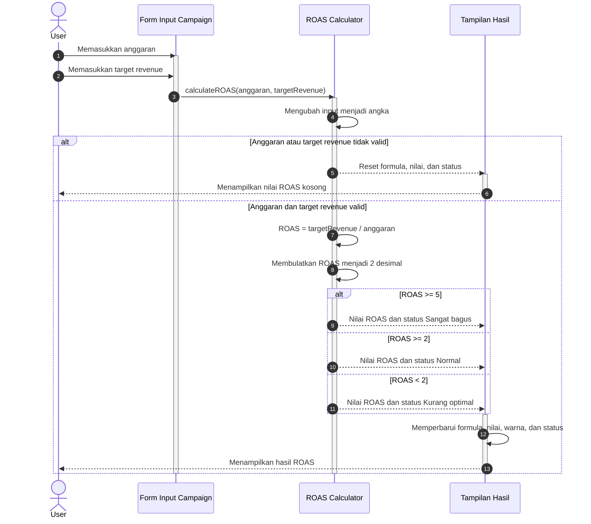

# Sequence Diagram ROAS Calculator

Sumber implementasi:
`tubes/frontend/Input/script.js` pada fungsi `calculateROAS()`.



## Rumus dan Status

```text
ROAS = Target Revenue / Anggaran
```

| Kondisi | Status |
|---|---|
| ROAS >= 5 | Sangat bagus |
| ROAS >= 2 dan < 5 | Normal |
| ROAS < 2 | Kurang optimal |
| Anggaran atau target revenue <= 0 | Hasil dikosongkan |

Perhitungan dilakukan secara lokal di browser. ROAS Calculator tidak
mengirim request ke `AuthController` atau database.
