# Sequence Diagram Campren

Dokumen ini memetakan alur utama aplikasi berdasarkan kode frontend, backend
Spring Boot, repository JPA, dan skema database yang ada di repository.

## 1. Arsitektur Umum

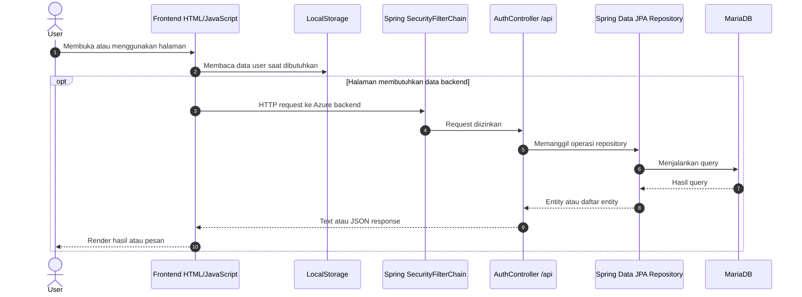

> `SecurityConfig` menonaktifkan CSRF dan mengizinkan seluruh request.
> Controller berinteraksi langsung dengan repository karena belum ada service
> layer terpisah.

## 2. Registrasi Pengguna

Sumber: `frontend/Registrasi/script.js` dan `POST /api/register`.

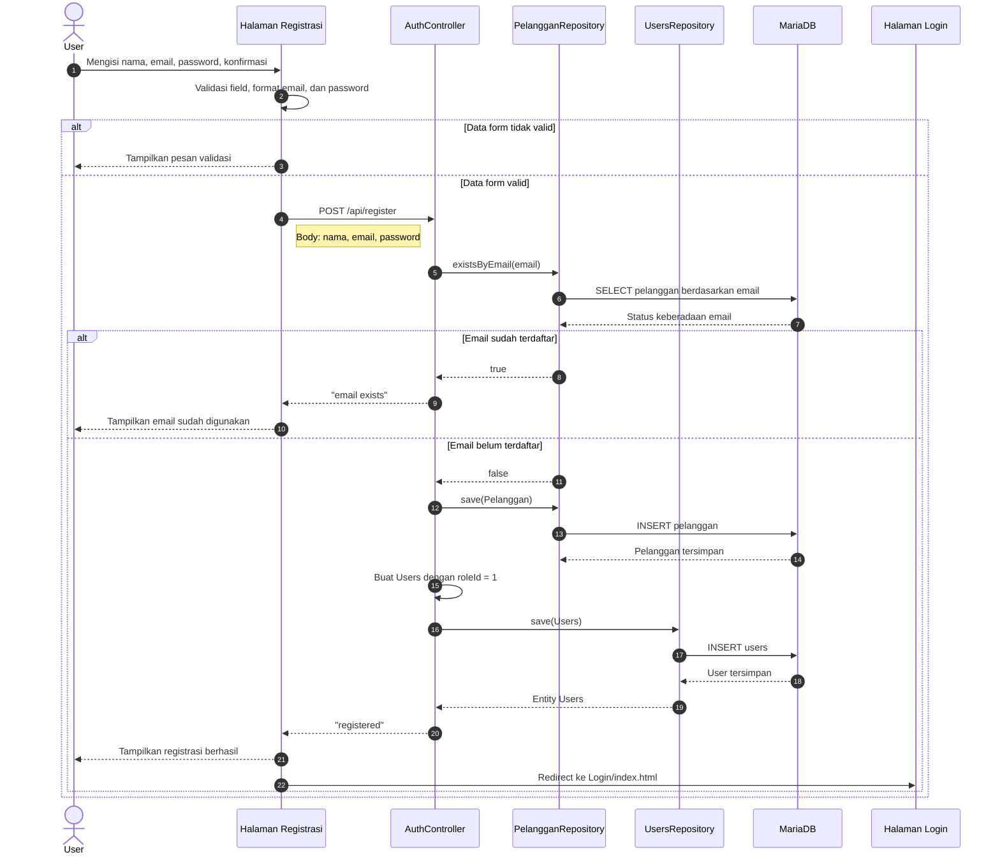

## 3. Login

Sumber: `frontend/Login/script.js` dan `POST /api/login`.

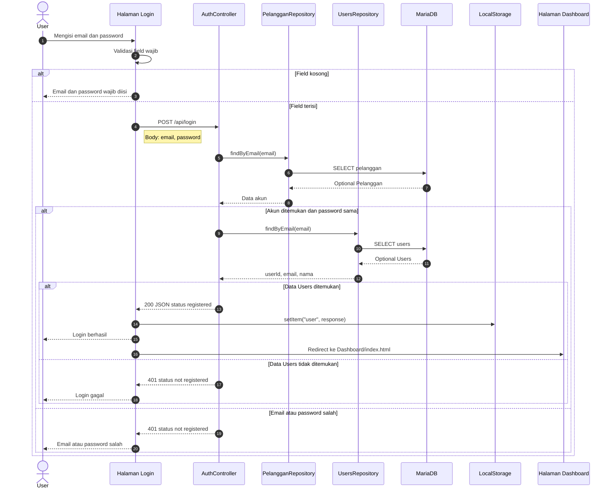

## 4. Reset Password

Sumber: `frontend/Resetpw/script.js` dan `PUT /api/change-password`.

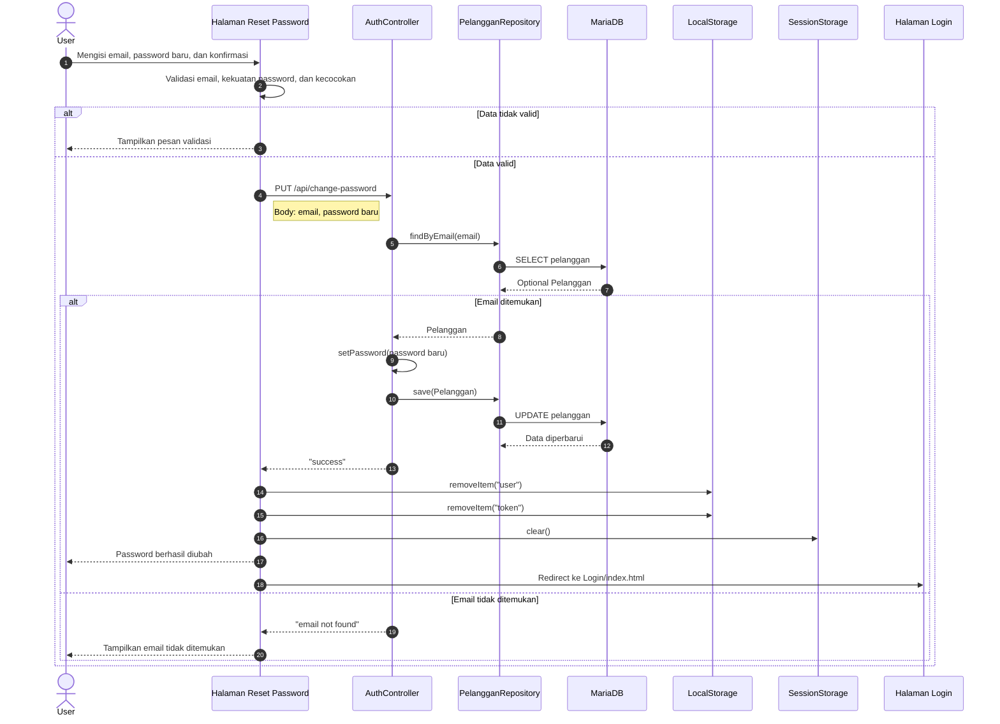

## 5. Membuat Campaign

Sumber: `frontend/Input/script.js` dan `POST /api/campaign`.

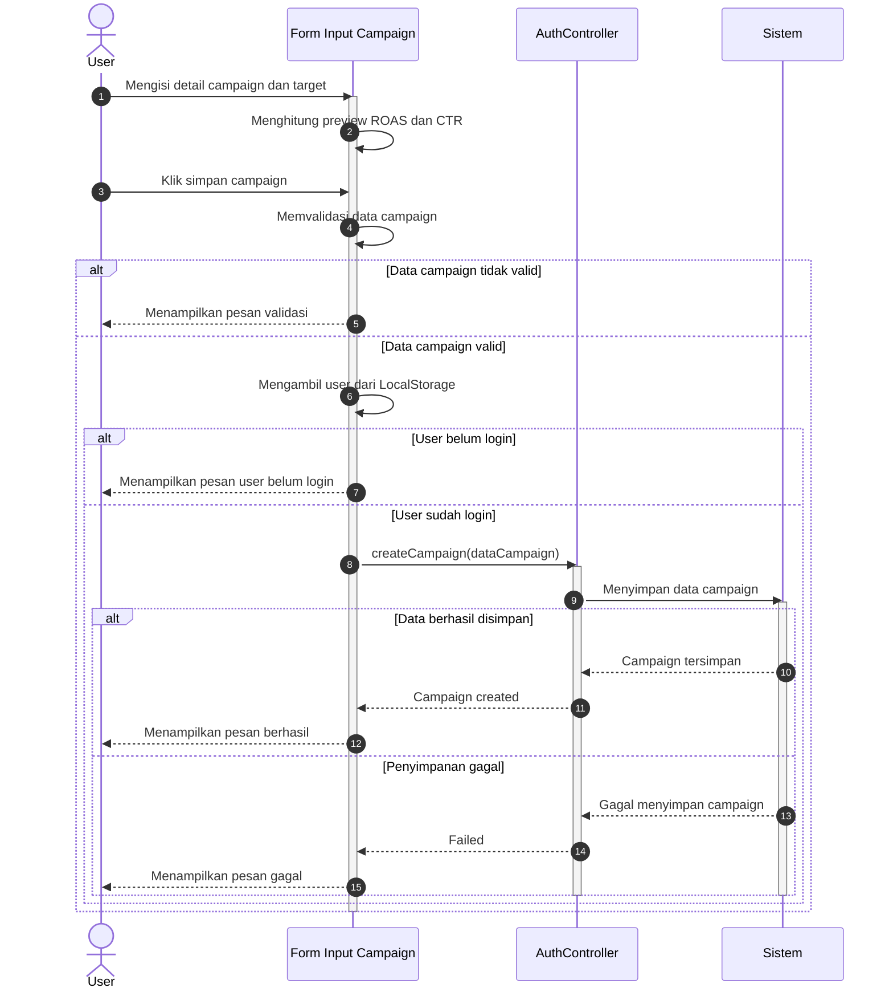

## 6. Memuat Dashboard

Sumber: `frontend/Dashboard/app.js`, `GET /api/GetUserCampaigns/{userId}`,
`GET /api/PerformanceReport/{id}`, dan `GET /api/roas/{id}`.

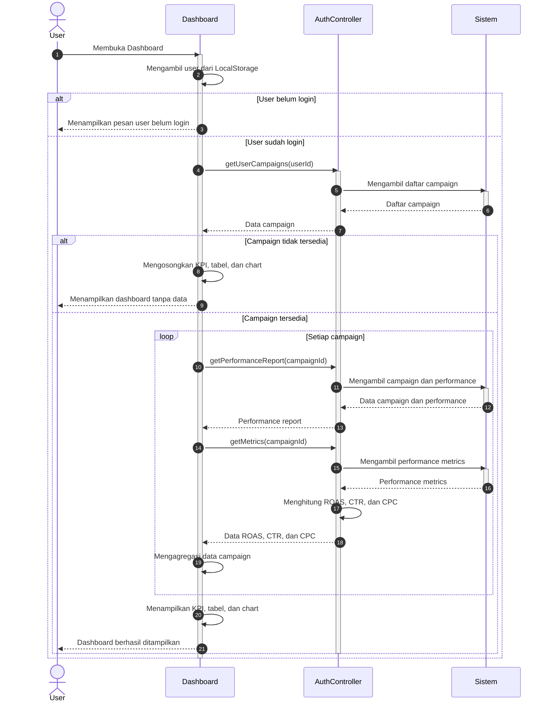

## 7. Mengedit Campaign

Sumber: `frontend/Dashboard/app.js` dan `PUT /api/campaign/{campaignId}`.

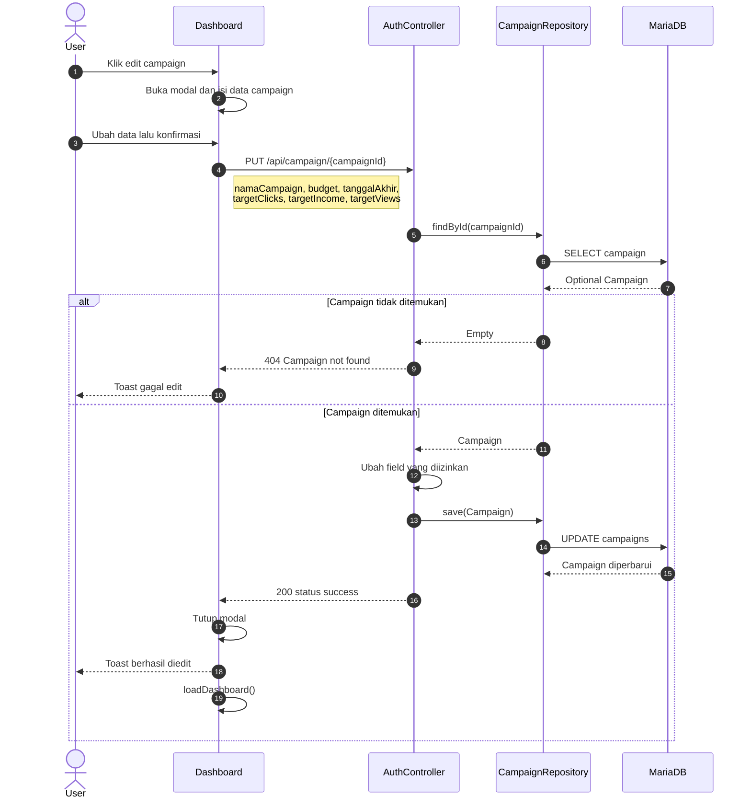

## 8. Menghapus Campaign

Sumber: `frontend/Dashboard/app.js` dan `DELETE /api/campaign/{campaignId}`.

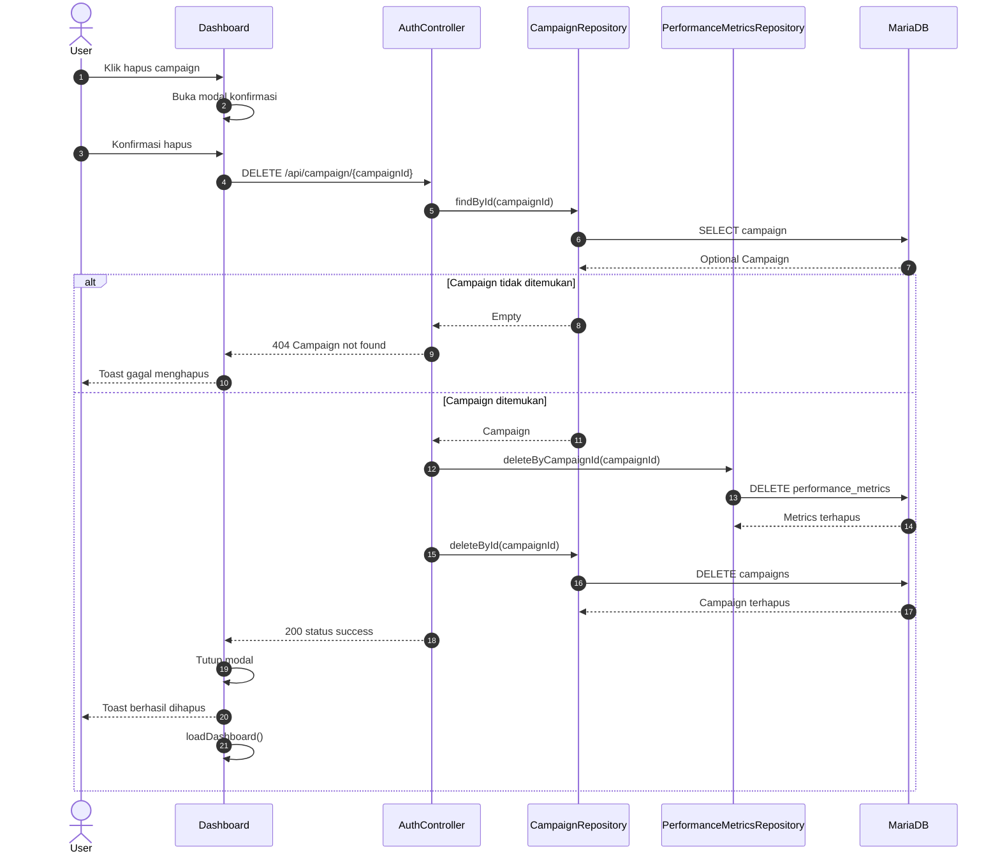

## 9. Tracking Performance

Sumber: `frontend/Tracking/script.js`.

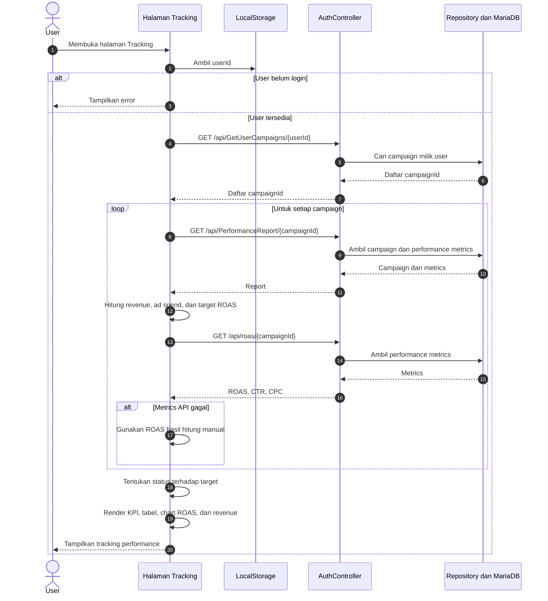

## 10. Product Breakdown

Sumber: `frontend/Product/script.js`.

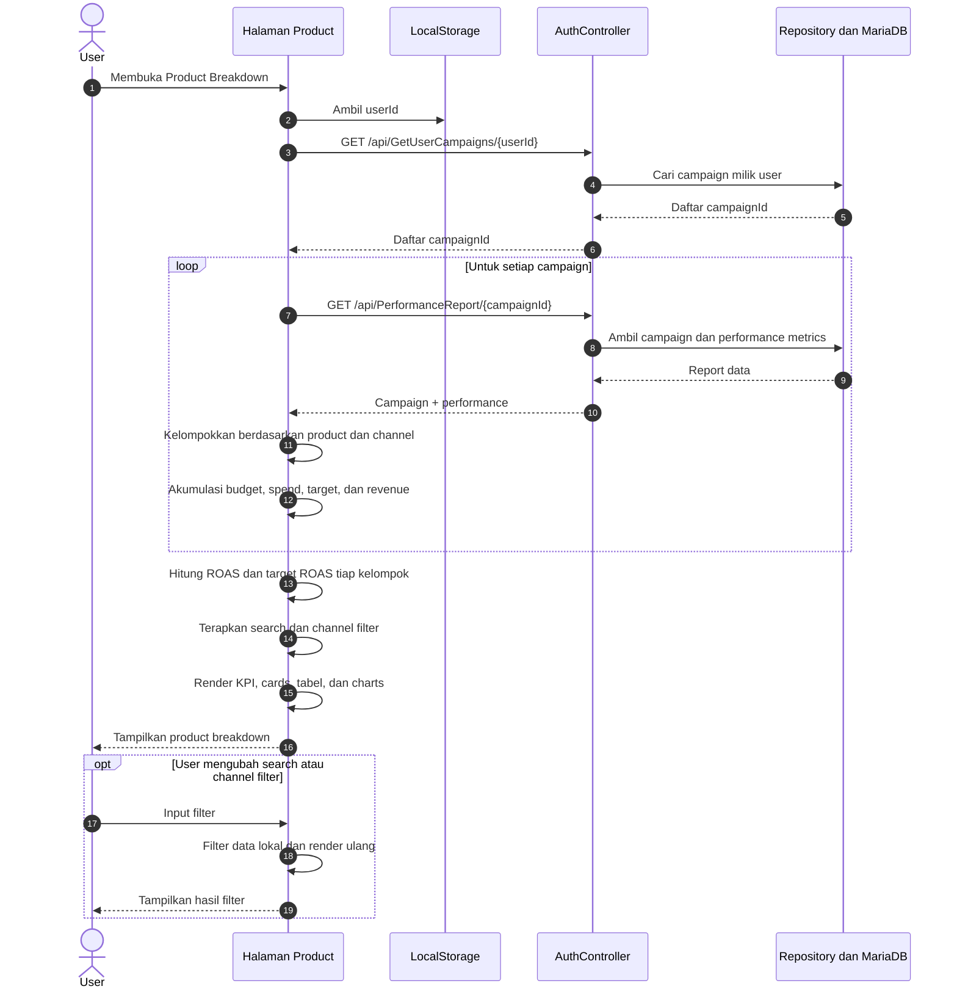

## 11. Comparison Campaign

Sumber: `frontend/Comparison/script.js`.

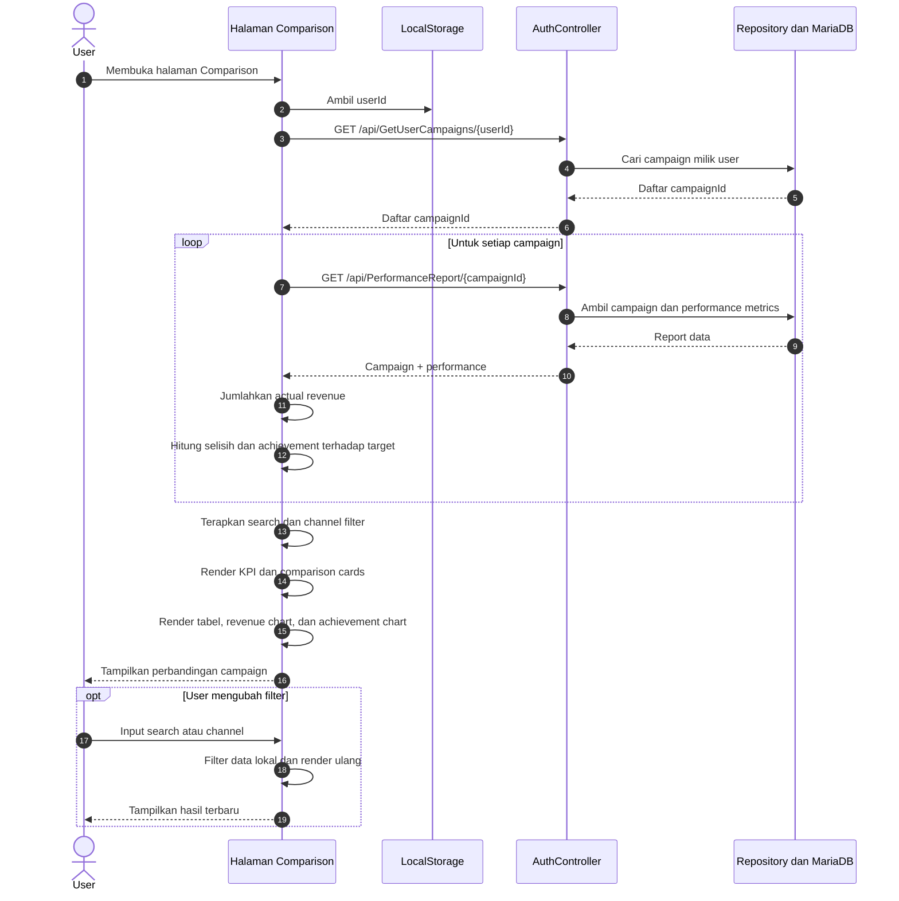

## 12. Memuat dan Mengekspor Report

Sumber: `frontend/Export/script.js`.

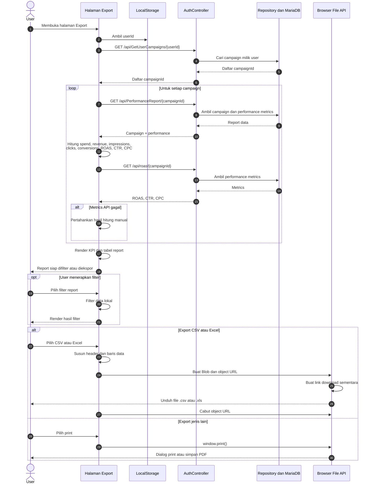

## 13. Endpoint dan Pemakainya

| Endpoint | Method | Frontend yang memakai |
|---|---|---|
| `/api/register` | POST | Registrasi |
| `/api/login` | POST | Login |
| `/api/change-password` | PUT | Reset Password |
| `/api/campaign` | POST | Input Campaign |
| `/api/GetUserCampaigns/{userId}` | GET | Dashboard, Tracking, Product, Comparison, Export |
| `/api/PerformanceReport/{id}` | GET | Dashboard, Tracking, Product, Comparison, Export |
| `/api/roas/{id}` | GET | Dashboard, Tracking, Export |
| `/api/campaign/{campaignId}` | PUT | Dashboard |
| `/api/campaign/{campaignId}` | DELETE | Dashboard |
